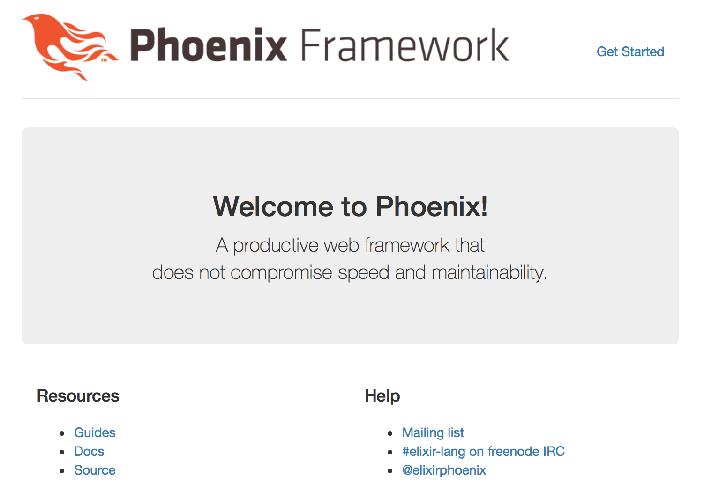
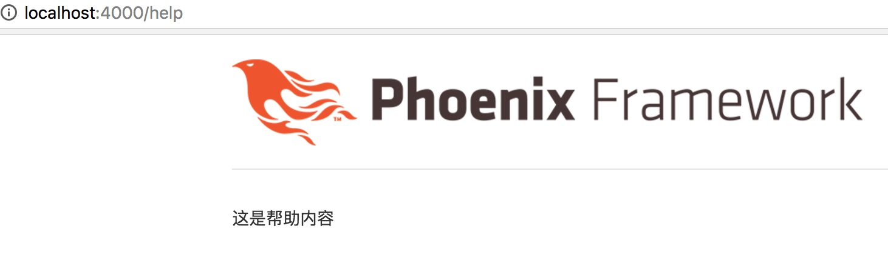

# Phoenix 初探

在[上一章](01-create-project.md)，我们创建了一个 TvRecipe 项目，并通过 Mix 工具启动服务器：

```bash
$ mix phoenix.server
```
现在，打开浏览器，访问 [http://localhost:4000](http://localhost:4000) 网址，我们会看到如下截图中的内容：



从输入网址到返回页面之间，都发生了什么？我们来简单了解一下。

1. 我们在浏览器访问 `http://localhost:4000` 网址
2. Phoenix 在服务器端接收到请求，它会检查 `tv_recipe` 目录下的 `web/router.ex` 文件，然后定位到如下内容：

    ```elixir
    scope "/", TvRecipe do
      pipe_through :browser # Use the default browser stack

      get "/", PageController, :index
    end
    ```
    我们看到，`router.ex` 文件里已经设定好规则：当用户以 `get` 方式请求网址 `/` 时，`PageController` 模块里的 `index` 动作将接手处理。
3. 我们来看看 `web/controllers/page_controller.ex` 文件内容：

    ```elixir
    defmodule TvRecipe.PageController do
      use TvRecipe.Web, :controller

      def index(conn, _params) do
        render conn, "index.html"
      end
    end
    ```
    目前文件中只有 `index` 一个动作，正是 `render conn, "index.html"` 渲染了我们上面截图中的内容。

    我是怎么知道 `PageController` 定义在 `web/controllers/page_controller.ex` 文件的？你可能会这样问。这里，我们涉及到 Phoenix 的一个惯例，或说约定：所有的 Controller 都归在 `web/controllers` 目录下。同理，所以的 View 都会定义在 `web/views` 目录下。

很简单是不是？

让我们依葫芦画瓢，添加一个 `/help` 页面试试。

1. 首先在 `web/router.ex` 文件中添加一个路由：

    ```elixir
    scope "/", TvRecipe do
      pipe_through :browser # Use the default browser stack

      get "/help", HelpController, :index # <- 这是我们新增的路由，# 是 Elixir 的注释
      get "/", PageController, :index
    end
    ```
2. 然后在 `web/controllers` 目录下新建一个 `help_controller.ex` 文件，添加如下内容：

    ```elixir
    defmodule TvRecipe.HelpController do
      use TvRecipe.Web, :controller

      def index(conn, _params) do
        render conn, "index.html"
      end
    end
    ```
3. 接着访问 `http://localhost:4000/help` 网址试试：

    ```html

    UndefinedFunctionError at GET /help
    function TvRecipe.HelpView.render/2 is undefined (module TvRecipe.HelpView is not available)
    ```
    报错了。错误里显示，我们还没有定义 `TvRecipe.HelpView` 模块。

4. 在 `web/views` 目录下新建 `help_view.ex` 文件，内容参照 `web/views/page_view.ex` 文件，如下：

    ```elixir
    defmodule TvRecipe.HelpView do
      use TvRecipe.Web, :view
    end
    ```
5. 再访问 `http://localhost:4000/help` 网址：

    ```html
    Phoenix.Template.UndefinedError at GET /help
    Could not render "index.html" for TvRecipe.HelpView, please define a matching clause for render/2 or define a template at "web/templates/help". No templates were compiled for this module.
    ```
    又报错了。错误消息提示我们要在 `web/templates/help` 目录下创建一个模板文件。

6. 在 `web/templates/help` 目录下新建一个 `index.html.eex` 文件，添加如下内容：

    ```html
    <p>这是帮助内容</p>
    ```
7. 再访问 `http://localhost:4000/help` 网址：

    

    这一次，页面终于显示正常。

从路由，到控制器，到视图，到模板，每一个步骤，一旦出错，Phoenix 都会有完整的提示。所以哪怕我们不了解它们是什么，也是可以按部就班，像上面一样成功添加新页面。

我们来简单整理下这一章涉及的几个概念：

1. [路由](http://www.phoenixframework.org/docs/routing)（router）- 决定某个请求由哪个控制器中的哪个动作来处理
2. [控制器](http://www.phoenixframework.org/docs/controllers)（controller）- 决定了怎么处理请求
3. [视图](http://www.phoenixframework.org/docs/views)（view）- 渲染模板
4. [模板](http://www.phoenixframework.org/docs/templates)（template）- 要展示怎样的内容与样式给用户

下一章，我们将对 [TvRecipe 项目做个规划](03-tv-recipe.md)，然后逐步推进项目，在推进项目的过程中，深入了解并掌握 Phoenix 的开发。