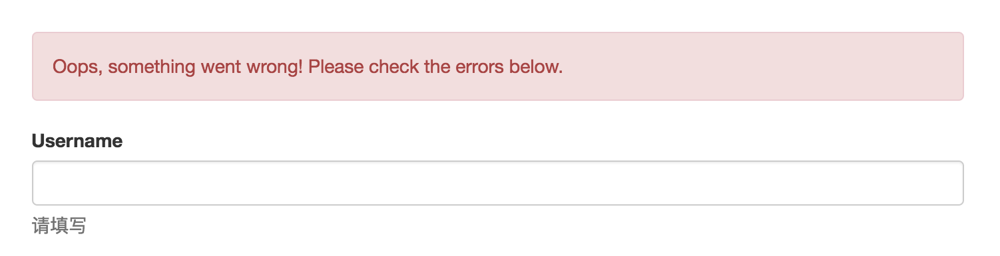
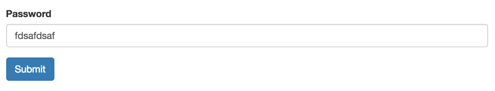
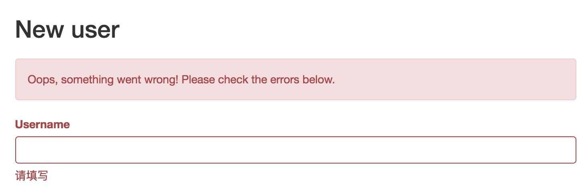

# 优化用户注册界面

截止上一章，我们基本完成用户注册的所有逻辑，但界面上还有些问题需要解决。

1. 错误信息不明显

    

    截图中可以看到，“请填写”三个字不突出，很多时候用户会视而不见。

2. 密码输入框

    

    在密码框中输入的内容，现在是明文显示，正常应该是用 * 号代替。

第 1 个问题。

Phoenix 生成的 `form.html.eex` 模板里使用了 Bootstrap [样式](https://getbootstrap.com/css/#forms-control-validation)：

```eex
<div class="form-group">
  <%= label f, :username, class: "control-label" %>
  <%= text_input f, :username, class: "form-control" %>
  <%= error_tag f, :username %>
</div>
```
但模板中生成的样式与 Bootstrap 的比，差了 `has-error` 这样的 CSS 状态类。我们可以给它补上：

```eex
diff --git a/web/templates/user/form.html.eex b/web/templates/user/form.html.eex
index 5857c33..8b50f25 100644
--- a/web/templates/user/form.html.eex
+++ b/web/templates/user/form.html.eex
@@ -5,7 +5,7 @@
     </div>
   <% end %>

-  <div class="form-group">
+  <div class="form-group <%= if f.errors[:username], do: "has-error" %>">
     <%= label f, :username, class: "control-label" %>
     <%= text_input f, :username, class: "form-control" %>
     <%= error_tag f, :username %>
```
这样我们的错误提示界面就会变成：



非常醒目。至于 Phoenix 生成的模板里为什么不带 `has-error`，可以看 [github 上的一个 issue](https://github.com/phoenixframework/phoenix/issues/1961)。

第 2 个问题就容易解决了，我们来看现有代码：

```eex
<div class="form-group">
  <%= label f, :password, class: "control-label" %>
  <%= text_input f, :password, class: "form-control" %>
  <%= error_tag f, :password %>
</div>
```
生成的模板里现在用了 `text_input`，它本来就是明文显示的，改为 [`password_input`](https://hexdocs.pm/phoenix_html/Phoenix.HTML.Form.html#password_input/3) 后，界面上就会用 * 号代替我们的输入。

这样，我们就结束了用户注册模块。接下来，我们将开始开发用户的登录/退出功能。

但是，且慢，还有一个差点被我们遗忘的。

## 控制器的测试

你可能对 `mix test test/models` 命令已经烂熟于心。但 `mix test test/controllers` 呢？

我们在生成用户的样板文件时，曾经生成过一个 `user_controller_test.exs` 文件，它的初始内容如下：

```elixir
defmodule PhoenixMoment.UserControllerTest do
  use PhoenixMoment.ConnCase

  alias PhoenixMoment.User
  @valid_attrs %{email: "some content", password: "some content", username: "some content"}
  @invalid_attrs %{}

  test "lists all entries on index", %{conn: conn} do
    conn = get conn, user_path(conn, :index)
    assert html_response(conn, 200) =~ "Listing users"
  end

  test "renders form for new resources", %{conn: conn} do
    conn = get conn, user_path(conn, :new)
    assert html_response(conn, 200) =~ "New user"
  end

  test "creates resource and redirects when data is valid", %{conn: conn} do
    conn = post conn, user_path(conn, :create), user: @valid_attrs
    assert redirected_to(conn) == user_path(conn, :index)
    assert Repo.get_by(User, @valid_attrs)
  end

  test "does not create resource and renders errors when data is invalid", %{conn: conn} do
    conn = post conn, user_path(conn, :create), user: @invalid_attrs
    assert html_response(conn, 200) =~ "New user"
  end

  test "shows chosen resource", %{conn: conn} do
    user = Repo.insert! %User{}
    conn = get conn, user_path(conn, :show, user)
    assert html_response(conn, 200) =~ "Show user"
  end

  test "renders page not found when id is nonexistent", %{conn: conn} do
    assert_error_sent 404, fn ->
      get conn, user_path(conn, :show, -1)
    end
  end

  test "renders form for editing chosen resource", %{conn: conn} do
    user = Repo.insert! %User{}
    conn = get conn, user_path(conn, :edit, user)
    assert html_response(conn, 200) =~ "Edit user"
  end

  test "updates chosen resource and redirects when data is valid", %{conn: conn} do
    user = Repo.insert! %User{}
    conn = put conn, user_path(conn, :update, user), user: @valid_attrs
    assert redirected_to(conn) == user_path(conn, :show, user)
    assert Repo.get_by(User, @valid_attrs)
  end

  test "does not update chosen resource and renders errors when data is invalid", %{conn: conn} do
    user = Repo.insert! %User{}
    conn = put conn, user_path(conn, :update, user), user: @invalid_attrs
    assert html_response(conn, 200) =~ "Edit user"
  end

  test "deletes chosen resource", %{conn: conn} do
    user = Repo.insert! %User{}
    conn = delete conn, user_path(conn, :delete, user)
    assert redirected_to(conn) == user_path(conn, :index)
    refute Repo.get(User, user.id)
  end
end
```
让我们运行下 `mix test test/controllers` 看看结果：

```bash
$ mix test test/controllers
....

  1) test updates chosen resource and redirects when data is valid (PhoenixMoment.UserControllerTest)
     test/controllers/user_controller_test.exs:47
     ** (RuntimeError) expected redirection with status 302, got: 200
     stacktrace:
       (phoenix) lib/phoenix/test/conn_test.ex:443: Phoenix.ConnTest.redirected_to/2
       test/controllers/user_controller_test.exs:50: (test)

....

  2) test creates resource and redirects when data is valid (PhoenixMoment.UserControllerTest)
     test/controllers/user_controller_test.exs:18
     ** (RuntimeError) expected redirection with status 302, got: 200
     stacktrace:
       (phoenix) lib/phoenix/test/conn_test.ex:443: Phoenix.ConnTest.redirected_to/2
       test/controllers/user_controller_test.exs:20: (test)

.

Finished in 0.3 seconds
11 tests, 2 failures
```
好消息是，11 个测试，有 9 个通过；坏消息是有 2 个未通过。

当然，我们需要根据实际情况做些调整：

```elixir
diff --git a/test/controllers/user_controller_test.exs b/test/controllers/user_controller_test.exs
index 6ee98f3..301add2 100644
--- a/test/controllers/user_controller_test.exs
+++ b/test/controllers/user_controller_test.exs
@@ -2,7 +2,7 @@ defmodule PhoenixMoment.UserControllerTest do
   use PhoenixMoment.ConnCase

   alias PhoenixMoment.User
-  @valid_attrs %{email: "some content", password: "some content", username: "some content"}
+  @valid_attrs %{email: "a@b.com", password: "some content", username: "chenxsan"}
   @invalid_attrs %{}

   test "lists all entries on index", %{conn: conn} do
@@ -18,7 +18,7 @@ defmodule PhoenixMoment.UserControllerTest do
   test "creates resource and redirects when data is valid", %{conn: conn} do
     conn = post conn, user_path(conn, :create), user: @valid_attrs
     assert redirected_to(conn) == user_path(conn, :index)
-    assert Repo.get_by(User, @valid_attrs)
+    assert Repo.get_by(User, Map.delete(@valid_attrs, :password))
   end

   test "does not create resource and renders errors when data is invalid", %{conn: conn} do
@@ -48,7 +48,7 @@ defmodule PhoenixMoment.UserControllerTest do
     user = Repo.insert! %User{}
     conn = put conn, user_path(conn, :update, user), user: @valid_attrs
     assert redirected_to(conn) == user_path(conn, :show, user)
-    assert Repo.get_by(User, @valid_attrs)
+    assert Repo.get_by(User, Map.delete(@valid_attrs, :password))
   end

   test "does not update chosen resource and renders errors when data is invalid", %{conn: conn} do
```
我们在代码中做了两点修改，一个是订正 `@valid_attrs`，另一个是修改 `Repo.get`，因为我们的 `User` 不再有 `password` 字段，所以应该从 `@valid_attrs` 中移除它，否则就会报错。

再运行测试，全部通过。