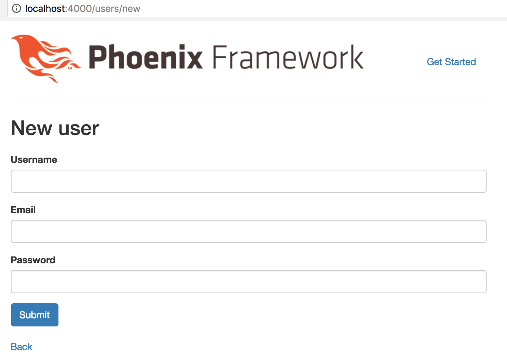

# 注册用户

在开始敲代码前，我们先确认一下，TvRecipe 项目中，用户有哪些数据需要存储，这些数据要加上什么限制，如果超出限制，要报告什么错误。

1. username（用户名）
    
    限制|错误提示
    ---|---
    必填|请填写
    不能重复|用户名已被人占用
    只能使用英文字母、数字及下划线|用户名只允许使用英文字母、数字及下划线
    最短 3 位|用户名最短 3 位
    最长 15 位|用户名最长 15 位
    不能是 `admin` 或 `administrator` 这种系统保留的用户名|系统保留，无法注册，请更换

2. email（邮箱）
    
    限制|错误提示
    ---|---
    必填|请填写
    不能重复|邮箱已被人占用
    邮箱必须包含 `@` 字符|邮箱格式错误

3. password（密码）

    限制|错误提示
    ---|---
    必填|请填写
    密码最短 6 位|密码最短 6 位
    密码不能明文存储在数据库中|-

好了，接下来准备写代码。

## 样板命令

还记得在 [Phoenix 初探](../02-explore-phoenix.md)一章里，我们是如何添加的帮助页面吗？

1. 在 `web/router.ex` 文件中添加路由
2. 添加控制器文件 `help_controller.ex`
3. 添加视图文件 `help_view.ex`
4. 添加模板文件 `index.html.eex`

但这样的手动添加过程太麻烦，还容易出错，应该有便捷的方法。

是的，Phoenix 提供了一系列的 mix 工具包。我们要接触的这个是 [`mix phoenix.gen.html`](https://hexdocs.pm/phoenix/Mix.Tasks.Phoenix.Gen.Html.html)。

请在命令行窗口下切换到 `tv_recipe` 目录，然后执行 `mix phoenix.gen.html` 命令：

```
$ cd tv_recipe
$ mix phoenix.gen.html User users username:string:unique email:string:unique password:string
```


执行命令后的输出如下：

```bash
* creating web/controllers/user_controller.ex
* creating web/templates/user/edit.html.eex
* creating web/templates/user/form.html.eex
* creating web/templates/user/index.html.eex
* creating web/templates/user/new.html.eex
* creating web/templates/user/show.html.eex
* creating web/views/user_view.ex
* creating test/controllers/user_controller_test.exs
* creating web/models/user.ex
* creating test/models/user_test.exs
* creating priv/repo/migrations/20170123145857_create_user.exs

Add the resource to your browser scope in web/router.ex:

    resources "/users", UserController

Remember to update your repository by running migrations:

    $ mix ecto.migrate
```
命令生成的文件很多，我们来看最底下的两段提示：

1. 添加 `resources "/users", UserController` 到 `web/router.ex` 文件中
2. 命令行下执行 `mix ecto.migrate`

前几章里，我们在添加帮助页面时，给 `web/router.ex` 文件添加过一行代码：

```elixir
get "/help", HelpController, :index
```

这里，`resources "/users", UserController` 起的是类似作用。我们可以不厌其烦地写成如下：

```elixir
get "/users", UserController, :index
get "/users/:id/edit", UserController, :edit
get "/users/new", UserController, :new
get "/users/:id", UserController, :show
post "/users", UserController, :create
patch "/users/:id", UserController, :update
put "/users/:id", UserController, :update
delete "/users/:id", UserController, :delete
```
可是，谁不会厌烦呢？所以 Phoenix 提供了 `resources` 这一便捷方法。

再来说说 `mix ecto.migrate`。

目前为止，我们还没有真正操作过数据库。可我们的用户数据必须存储在数据库中，我们难道要自己手动执行 SQL 语句来创建用户表格？

不不不，我们只要运行 `mix ecto.migrate`，一切便都妥当了：

```bash
$ mix ecto.migrate
Compiling 15 files (.ex)
Generated tv_recipe app

11:08:12.056 [info]  == Running TvRecipe.Repo.Migrations.CreateUser.change/0 forward

11:08:12.057 [info]  create table users

11:08:12.065 [info]  create index users_username_index

11:08:12.066 [info]  create index users_email_index

11:08:12.067 [info]  == Migrated in 0.0s
```

操作完上述两步后，因为某些编辑器可能导致的代码重载问题，你需要重启 Phoenix 服务器 - 按两次 Ctrl-C，然后重新执行 `mix phoenix.server`。

之后在浏览器中打开网址 `http://localhost:4000/users/new`：



有了。是不是很惊讶？我们用 `mix phoenix.gen.html` 命令生成的样板，功能已经很完善：增删改查功能全都有了。我们需要的，只是在样板基础上做点修改。

[接下来](01-username-required.md)几章，我们将一步步完成本章开头列出的限制条件。


