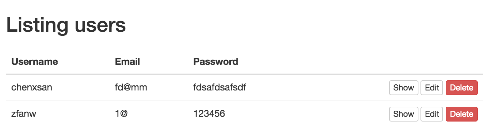
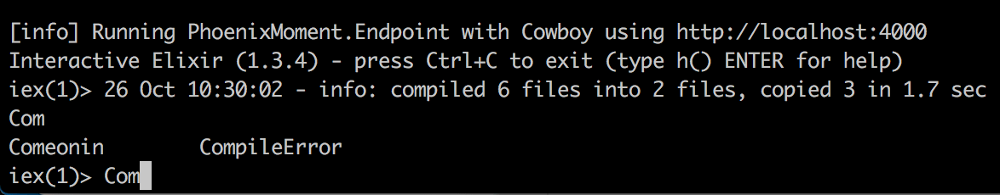

# 安全存储密码

如果你在前面章节里，曾注册过用户，则打开 [http://localhost:4000/users](http://localhost:4000/users) 网址，你会看到类似如下截图的内容：



密码字段一览无余，如果数据库被人入侵，则用户密码全部暴露。

所以，这一章里，我们要对用户密码做哈希处理，然后才保存到数据库中。我们要用到第三方的 [Comeonin](https://github.com/riverrun/comeonin) 库。

## 添加依赖

首先，打开项目依赖管理文件 `mix.exs`，在文件中添加 `comeonin`：

```elixir
diff --git a/mix.exs b/mix.exs
index 72666bc..513a0b7 100644
--- a/mix.exs
+++ b/mix.exs
@@ -19,7 +19,7 @@ defmodule PhoenixMoment.Mixfile do
   def application do
     [mod: {PhoenixMoment, []},
      applications: [:phoenix, :phoenix_pubsub, :phoenix_html, :cowboy, :logger, :gettext,
-                    :phoenix_ecto, :postgrex]]
+                    :phoenix_ecto, :postgrex, :comeonin]]
   end

   # Specifies which paths to compile per environment.
@@ -37,7 +37,8 @@ defmodule PhoenixMoment.Mixfile do
      {:phoenix_html, "~> 2.6"},
      {:phoenix_live_reload, "~> 1.0", only: :dev},
      {:gettext, "~> 0.11"},
-     {:cowboy, "~> 1.0"}]
+     {:cowboy, "~> 1.0"},
+     {:comeonin, "~> 2.5"}]
   end
   ```

我们在 `mix.exs` 文件中共添加了两处代码，一处是 `deps` 函数中，定义我们要用的 `comeonin` 版本；另一处是 `application` 函数中，表示构建时应将 `comeonin` 打包进去。

接着在命令行下执行：

```bash
$ mix do deps.get, compile
```
该命令从远程下载了我们新增的 `comeonin` 依赖并编译。

那么，怎么确认 `comeonin` 安装成功？在之前，我们一直是用 `mix phoenix.server` 命令来启动服务器的，接下来，我们要换一种启动方式：

```bash
$ iex -S mix phoenix.server
```
区别在哪？我们来看看后者启动后的结果：

```
$ iex -S mix phoenix.server
Erlang/OTP 19 [erts-8.1] [source] [64-bit] [smp:4:4] [async-threads:10] [hipe] [kernel-poll:false] [dtrace]

[info] Running PhoenixMoment.Endpoint with Cowboy using http://localhost:4000
Interactive Elixir (1.3.4) - press Ctrl+C to exit (type h() ENTER for help)
iex(1)> 26 Oct 09:58:08 - info: compiled 6 files into 2 files, copied 3 in 1.7 sec
```
看到区别了么？我们用 `iex -S mix phoenix.server` 启动后，可以使用 Elixir 的 [`iex`](http://elixir-lang.org/docs/stable/iex/IEx.html)。

比如，我们可以输入 `Com` 然后按 Tab 键：



`iex` 下自动补全 `Comeonin`，证明我们已经可以在 PhoenixMoment 项目中使用它。

## `password` 字段的处理

现在的情况是，数据库不打算存储 `password`，因为它是明文的。我们要把哈希处理后的密码存入另一个字段，比如 `password_hash`。

但我们的数据库里只有 `password` 字段，还没有 `password_hash`。怎么办？我们仍通过 migration 来做增减。

1. 创建 migration 文件

    ```bash
    $ mix ecto.gen.migration alter_user_table
    * creating priv/repo/migrations
    * creating priv/repo/migrations/20161026040715_alter_user_table.exs
    ```
2. 打开新建的 `20161026040715_alter_user_table.exs` 文件，[`remove`](https://hexdocs.pm/ecto/Ecto.Migration.html#remove/1) 掉 `password` 字段，然后 [`add`](https://hexdocs.pm/ecto/Ecto.Migration.html#add/3) `password_hash` 字段：

    ```elixir
    diff --git a/priv/repo/migrations/20161026040715_alter_user_table.exs b/priv/repo/migrations/20161026040715_alter_user_table.exs
    index 31d8f6e..0d77b96 100644
    --- a/priv/repo/migrations/20161026040715_alter_user_table.exs
    +++ b/priv/repo/migrations/20161026040715_alter_user_table.exs
    @@ -2,6 +2,9 @@ defmodule PhoenixMoment.Repo.Migrations.AlterUserTable do
      use Ecto.Migration

      def change do
    -
    +    alter table(:users) do
    +      remove :password
    +      add :password_hash, :string
    +    end
      end
    end
    ```
3. 执行 `mix ecto.migrate` 落实 migration 中的修改：

    ```bash
    $ mix ecto.migrate

    12:11:15.204 [info]  == Running PhoenixMoment.Repo.Migrations.AlterUserTable.change/0 forward

    12:11:15.204 [info]  alter table users

    12:11:15.243 [info]  == Migrated in 0.0s
    ```
4. 在上一步里，我们修改了数据库里 `users` 表的结构。那么，`user.ex` 文件中的 `password` 字段怎么办？要删除吗？删除了话，前面做的那些围绕 `password` 的验证怎么办？

    不，我们要留着 `password`，但要给它加上 `virtual: true`，表示它是个临时字段，不存储到数据库中：

    ```elixir
    diff --git a/web/models/user.ex b/web/models/user.ex
    index 0796d93..bf2a66f 100644
    --- a/web/models/user.ex
    +++ b/web/models/user.ex
    @@ -4,7 +4,8 @@ defmodule PhoenixMoment.User do
      schema "users" do
        field :username, :string
        field :email, :string
    -    field :password, :string
    +    field :password, :string, virtual: true
    +    field :password_hash, :string

        timestamps()
      end
    ```
    你可能会好奇，不加 `virtual: true` 会怎样，会这样：

    ```bash
    ** (Postgrex.Error) ERROR (undefined_column): column "password" of relation "users" does not exist
    (ecto) lib/ecto/adapters/sql.ex:463: Ecto.Adapters.SQL.struct/6
    (ecto) lib/ecto/repo/schema.ex:397: Ecto.Repo.Schema.apply/4
    (ecto) lib/ecto/repo/schema.ex:193: anonymous fn/11 in Ecto.Repo.Schema.do_insert/4
    (ecto) lib/ecto/repo/schema.ex:124: Ecto.Repo.Schema.insert!/4
    ```
    因为数据表里已经移除了 `password` 字段，数据也就无法插入。

话说回来，我们做了这么多的修改，是否破坏了代码呢？我们可以运行测试，确证下。

一切顺利。那就继续下一步。

## 存储哈希后的密码

我们至今还没有提过 [Changeset](https://hexdocs.pm/ecto/Ecto.Changeset.html) 的涵义。

官方的文档是这样说的：

> Changesets allow filtering, casting, validation and definition of constraints when manipulating structs.

通俗点讲，它是一种数据处理机制，数据在插入数据库前，先要经过一系列**流程**，验证数据的正确，保证数据的唯一等等，没有错误，数据才插入到表中，如果有错误，则将错误写入统一的格式中，方便我们处理。

再回到我们的问题，我们能够从 changeset 里得到 `password` 的数据，接下来要怎么处理？

`user.ex` 文件现在的 `changeset` 函数是这样的：

```elixir
  def changeset(struct, params \\ %{}) do
    struct
    |> cast(params, [:username, :email, :password])
    |> validate_required([:username, :email, :password], message: "请填写")
    |> validate_length(:username, min: 3, message: "用户名最短 3 位")
    |> validate_length(:username, max: 15, message: "用户名最长 15 位")
    |> unique_constraint(:username, name: :users_lower_username_index, message: "用户名已被人占用")
    |> validate_format(:username, ~r/^[a-zA-Z0-9_]+$/, message: "用户名只允许使用英文字母、数字及下划线")
    |> validate_exclusion(:username, ~w(admin administrator), message: "系统保留，无法注册，请更换")
    |> validate_format(:email, ~r/@/, message: "邮箱格式错误")
    |> unique_constraint(:email, name: :users_lower_email_index, message: "邮箱已被人占用")
    |> validate_length(:password, min: 6, message: "密码最短 6 位")
  end
```
我们可以在 `changeset` 末尾再加一道工序：

```elixir
diff --git a/web/models/user.ex b/web/models/user.ex
index bf2a66f..f64aaab 100644
--- a/web/models/user.ex
+++ b/web/models/user.ex
@@ -25,5 +25,6 @@ defmodule PhoenixMoment.User do
     |> validate_format(:email, ~r/@/, message: "邮箱格式错误")
     |> unique_constraint(:email, name: :users_lower_email_index, message: "邮箱已被人占用")
     |> validate_length(:password, min: 6, message: "密码最短 6 位")
+    |> put_password_hash()
   end
 end
```
[`|>`](http://elixir-lang.org/getting-started/enumerables-and-streams.html#the-pipe-operator) 是 Elixir 的管道操作符，如果你用过 Linux/Unix 的 pipe，你可能已经很清楚。

如果你没用过，则可以这么理解，`|>` 前的函数会返回一个数据，这个数据作为第一个参数传入给 `|>` 后函数。

拿上面的 `changeset` 函数说，它等同于：

```elixir
# 接收上一个 changeset，返回一个新的 changeset
changeset = validate_length(changeset, :password, min: 6, message: "密码最短 6 位")
# 接收上一个 changeset，返回一个新的 changeset
changeset = put_password_hash(changeset)
```
当然，没人喜欢这么写。

现在，我们还定义 `put_password_hash` 函数：

```elixir
diff --git a/web/models/user.ex b/web/models/user.ex
index f64aaab..167cc13 100644
--- a/web/models/user.ex
+++ b/web/models/user.ex
@@ -27,4 +27,13 @@ defmodule PhoenixMoment.User do
     |> validate_length(:password, min: 6, message: "密码最短 6 位")
     |> put_password_hash()
   end
+
+  defp put_password_hash(changeset) do
+    case changeset do
+      %Ecto.Changeset{valid?: true, changes: %{password: password}} ->
+        put_change(changeset, :password_hash, Comeonin.Bcrypt.hashpwsalt(password))
+      _ ->
+        changeset
+    end
+  end
 end
```

这里，涉及了 Elixir 的几个知识。

不过先插一段闲话。不知道你发现没有，从第一章到现在，我都没有提过，学习 PhoenixFramework 要掌握 Elixir 到什么程度。我认为，哪怕不懂 Elixir，也是可以学 Phoenix 的。**用**是最快的学习方式，碰上不懂的，再去借助搜索引擎，这样才有的放矢。等到时机成熟，再完整地学习一遍 Elixir，因为有了实践经验，就不会一头雾水。

好了，我们来解释下上面的几个新知识点：

1. `defp` - 我们之前就接触过 `def`，它用于定义函数，而 `defp` 是定义一个隐私（private）函数，隐私函数只能在它所在的模块内部使用
2. `case do` - 根据不同匹配结果执行不同代码，类似 `if else`
3. 模式匹配（pattern matching）- [模式匹配](http://elixir-lang.org/getting-started/pattern-matching.html) 是 Elixir 很重要的一个特性，利用它，我们能够很方便的从数据中提取数据，以上面定义的 `put_password_hash` 函数来说，`changeset = %Ecto.Changeset{valid?: true, changes: %{password: password}}` 就可以把 `password` 的值提取出来。
4. `put_change` - 修改 changeset 中的数据

这样，我们就完成密码的安全存储。

当然，我们还要添加一个测试，用 [Comeonin.Bcrypt.checkpw](https://hexdocs.pm/comeonin/Comeonin.Bcrypt.html#checkpw/2) 来保证 `put_password_hash` 函数的结果：

```elixir
diff --git a/test/models/user_test.exs b/test/models/user_test.exs
index f3a7c44..8285d8e 100644
--- a/test/models/user_test.exs
+++ b/test/models/user_test.exs
@@ -150,4 +150,9 @@ defmodule PhoenixMoment.UserTest do
     attrs = %{@valid_attrs | password: "12345"}
     assert {:password, "密码最短 6 位"} in errors_on(%User{}, attrs)
   end
+
+  test "password should be hashed and put into password_hash" do
+    %{changes: changes} = User.changeset(%User{}, @valid_attrs)
+    assert Comeonin.Bcrypt.checkpw(changes.password, changes.password_hash)
+  end
 end
```

运行测试，通过。

下一章里，我们将做一些[扫尾工作](09-optimize-ui.md)，然后结束用户注册模块。
