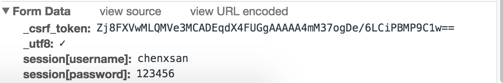

# 登录

这一次，我们没有 `mix phoenix.gen.html` 可以用，所以要一步一步写了。

它的过程，跟[添加帮助文件一章](02-explore-phoenix.md)的流程是一样的。

## 添加路由

打开 `router.ex` 文件，添加一个新路由：

```elixir
diff --git a/web/router.ex b/web/router.ex
index 0eccc31..0635f5e 100644
--- a/web/router.ex
+++ b/web/router.ex
@@ -16,6 +16,7 @@ defmodule PhoenixMoment.Router do
   scope "/", PhoenixMoment do
     pipe_through :browser # Use the default browser stack

+    resources "/sessions", SessionController, only: [:new, :create, :delete]
     resources "/users", UserController
     get "/", PageController, :index
   end
```
比起 "/users" 的路由，新增的路由里多了一个 `only` 参数。这是因为 `resources` 展开后的路由很多，而我们只要其中三个：

1. `:new` - 登录界面
2. `:create` - 登录的逻辑
3. `:delete` - 退出登录的逻辑

## 创建 `SessionController` 模块

在 `web/controllers` 目录下新建一个 `session_controller.ex` 文件，内容如下：

```elixir
defmodule PhoenixMoment.SessionController do
  use PhoenixMoment.Web, :controller

  def new(conn, _params) do
    render conn, "new.html"
  end

  def create(conn, _params) do
    
  end

  def delete(conn, _params) do
    
  end
end
```
你可能在想，`_params` 是什么意思。在 Elixir 下，如果一个参数没被用到，编译时就会有提示，假如你有强迫症，可以给这个未用到的参数加个 `_` 前缀，就能消除编译时的提示。

## 创建 `SessionView` 模块

在 `web/views` 目录下新建一个 `session_view.ex` 文件，内容如下：

```elixir
defmodule PhoenixMoment.SessionView do
  use PhoenixMoment.Web, :view
end
```
在 Phoenix 下，View 与 templates 是分开的，其中 View 是模块（module），而 templates 在编译后，会变成 View 模块中的函数。举 `render "index.html", changeset: changeset` 来说，它在编译后其实是这样的：

```
def render("index.html", assigns) do
  # do whatever
end
```
这也是为什么我们在定义模板之前，要先定义视图的原因。

## 创建 `new.html.eex` 模板文件

在 `web/templates/session` 目录中新建一个 `new.html.eex` 模板文件。

现在，我们已经可以访问 [`http://localhost:4000/sessions/new`](http://localhost:4000/sessions/new) 页面，但目前还一片空白，因为我们还没有往 `new.html.eex` 文件中添加内容。

**等等，你是怎么知道要访问这个网址的？**

因为 Phoenix 提供了一个命令用于查看当前项目中的所有路由：

```bash
$ mix phoenix.routes
Generated phoenix_moment app
session_path  GET     /sessions/new    PhoenixMoment.SessionController :new
session_path  POST    /sessions        PhoenixMoment.SessionController :create
session_path  DELETE  /sessions/:id    PhoenixMoment.SessionController :delete
   user_path  GET     /users           PhoenixMoment.UserController :index
   user_path  GET     /users/:id/edit  PhoenixMoment.UserController :edit
   user_path  GET     /users/new       PhoenixMoment.UserController :new
   user_path  GET     /users/:id       PhoenixMoment.UserController :show
   user_path  POST    /users           PhoenixMoment.UserController :create
   user_path  PATCH   /users/:id       PhoenixMoment.UserController :update
              PUT     /users/:id       PhoenixMoment.UserController :update
   user_path  DELETE  /users/:id       PhoenixMoment.UserController :delete
   page_path  GET     /                PhoenixMoment.PageController :index
```
在 `phoenix_moment` 目录下执行 `mix phoenix.routes` 命令，我们就得到所有的路由信息，哪个 url 由哪个控制器的哪个动作处理，一目了然。

那么，`new.html.eex` 文件内容要怎么写？

首先想到的，自然是参照 `web/templates/user` 目录下的 `form.eex.html` 文件，照猫画虎：

```eex
<%= form_for @changeset, @action, fn f -> %>
  <%= if @changeset.action do %>
    <div class="alert alert-danger">
      <p>Oops, something went wrong! Please check the errors below.</p>
    </div>
  <% end %>

  <div class="form-group <%= if f.errors[:username], do: "has-error" %>">
    <%= label f, :username, class: "control-label" %>
    <%= text_input f, :username, class: "form-control" %>
    <%= error_tag f, :username %>
  </div>

  <div class="form-group <%= if f.errors[:password], do: "has-error" %>">
    <%= label f, :password, class: "control-label" %>
    <%= password_input f, :password, class: "form-control" %>
    <%= error_tag f, :password %>
  </div>

  <div class="form-group">
    <%= submit "Submit", class: "btn btn-primary" %>
  </div>
<% end %>
```
但 `http://localhost:4000/sessions/new` 页面报告错误了：

```html
ArgumentError at GET /sessions/new
assign @changeset not available in eex template.
```

报错是肯定的，我们前面草草写就的 `new` 函数里，只是一行 `render "new.html"`，并没有传递 `changeset` - 因为我们根本没有 `changeset` 可以传递。

怎么办？来看看 `Phoenix.HTML.Form` 的[文档](https://hexdocs.pm/phoenix_html/Phoenix.HTML.Form.html)描述的 `form_for` 的三种应用场景：

1. with changeset data - when information to populate the form comes from a changeset
2. with connection data - when a form is created based on the information in the connection (aka Plug.Conn)
3. without form data - when the functions are used directly, outside of a form

我们没有 `changeset`，但是有表单数据，适用第二种。

根据 `form_for` 的[用法](https://hexdocs.pm/phoenix_html/Phoenix.HTML.Form.html#form_for/4)，我们将 `new.html.eex` 做以下修改：

```elixir
diff --git a/web/templates/session/new.html.eex b/web/templates/session/new.html.eex
index 9c1f842..2a9f843 100644
--- a/web/templates/session/new.html.eex
+++ b/web/templates/session/new.html.eex
@@ -1,11 +1,5 @@
 <h2>登录</h2>
-<%= form_for @changeset, @action, fn f -> %>
-  <%= if @changeset.action do %>
-    <div class="alert alert-danger">
-      <p>Oops, something went wrong! Please check the errors below.</p>
-    </div>
-  <% end %>
-
+<%= form_for @conn, session_path(@conn, :create), [as: :session], fn f -> %>
   <div class="form-group <%= if f.errors[:username], do: "has-error" %>">
     <%= label f, :username, class: "control-label" %>
     <%= text_input f, :username, class: "form-control" %>
```
`session_path(@conn, :create)` 是表单数据要提交的路径，`as: :session` 则表示表单数据提交时，是保存在 `session` 的键名下的。

打开浏览器开发者工具的网络面板，然后在浏览器中尝试提交数据，查看 http 请求的情况：



数据有了，就在 `session` 键下，数据是以 `POST` 方式提交到 `http://localhost:4000/sessions` 地址的，对照 `mix phoenix.routes` 的结果，我们知道，`SessionController` 中的 `create` 函数会处理该类请求。

但在完善 `create` 函数前，我们需要写个测试，保证我们上面的 `new` 函数正确。

在 `test/controllers` 目录下新建一个 `session_controller_test.exs` 文件，它的模板可以参考其它测试文件：

```elixir
defmodule PhoenixMoment.SessionControllerTest do
  use PhoenixMoment.ConnCase

  test "renders form for user login", %{conn: conn} do
    conn = get conn, session_path(conn, :new)
    assert html_response(conn, 200) =~ "登录"
  end
end
```
我想你已经猜出，`assert html_response(conn, 200) =~ "登录"` 表示 http 响应为 200，并且响应中包含`登录`两字。

运行我们的测试 `mix test test/controllers`，全数通过。

## create 函数

还记得模式匹配吗？我们这回还要用它来抽取 `session` 键下的数据，然后跟数据库中存储的 `password_hash` 做比较：

```elixir
def create(conn, %{"session" => %{"username" => username, "password" => password}}) do
```
但在那之前，我们先加几个测试，策划下我们的代码：

```elixir
diff --git a/test/controllers/session_controller_test.exs b/test/controllers/session_controller_test.exs
index d4023f6..0f01478 100644
--- a/test/controllers/session_controller_test.exs
+++ b/test/controllers/session_controller_test.exs
@@ -1,8 +1,45 @@
 defmodule PhoenixMoment.SessionControllerTest do
   use PhoenixMoment.ConnCase
+  alias PhoenixMoment.{Repo, User}
+  @valid_attrs %{email: "a@b.com", password: "some content", username: "chenxsan"}

   test "renders form for user login", %{conn: conn} do
     conn = get conn, session_path(conn, :new)
     assert html_response(conn, 200) =~ "登录"
   end
+
+  describe "create/2" do
+    # 用户名/密码组合正确，跳转到站点主页，并显示“欢迎回来”
+    test "logins user and redirects when data is valid", %{conn: conn} do
+      # 在数据库中新建一个用户
+      changeset = User.changeset(%User{}, @valid_attrs)
+      Repo.insert!(changeset)
+
+      # 登录该用户
+      conn = post conn, session_path(conn, :create), session: Map.delete(@valid_attrs, :email)
+      assert redirected_to(conn) == page_path(conn, :index)
+
+      # 读取首页，返回中应该包含“欢迎回来”
+      conn = get conn, page_path(conn, :index)
+      assert html_response(conn, 200) =~ "欢迎回来"
+    end
+
+    # 用户名存在，但密码不正确，提示“用户名或密码错误”
+    test "shows error message when user's password is wrong", %{conn: conn} do
+      # 在数据库中新建一个用户
+      changeset = User.changeset(%User{}, @valid_attrs)
+      Repo.insert!(changeset)
+
+      # 使用错误的密码登录该用户
+      conn = post conn, session_path(conn, :create), session: %{username: "chenxsan", password: "hello"}
+      assert html_response(conn, 200) =~ "用户名或密码错误"
+    end
+
+    # 用户名不存在，为防止暴力破解，提示“用户名或密码错误”
+    test "shows error message when user not exist", %{conn: conn} do
+      # 在数据库中新建一个用户
+      changeset = User.changeset(%User{}, @valid_attrs)
+      Repo.insert!(changeset)
+
+      # 使用错误的密码登录该用户
+      conn = post conn, session_path(conn, :create), session: %{username: "sam", password: "hello"}
+      assert html_response(conn, 200) =~ "用户名或密码错误"
+    end
+  end
 end
```

我们共添加三个测试，它们的各自用途注释中也一一说明了。

代码中有几个新知识需要提一下：

1. `alias PhoenixMoment.{Repo, User}` - [alias](http://elixir-lang.org/getting-started/alias-require-and-import.html#alias) 允许我们给模块设置别名，这样可以减少后期输入，比如上面的测试代码里，在顶部加上 `alias PhoenixMoment.{Repo, User}`，我们就可以在后面的代码中使用 `Repo` 与 `User`，而不必写完整的 `PhoenixMoment.Repo` 与 `PhoenixMoment.User`。
2. `describe` - 我们之前的测试代码里只出现过 `test`，同类测试并没办法归类，使用 `describe` 可以更好的组织测试代码。

接下来，我们开始写 `create` 函数：

```elixir
def create(conn, %{"session" => %{"username" => username, "password" => password}}) do
  # 根据 username 从数据库中查找用户
  user = PhoenixMoment.Repo.get_by(PhoenixMoment.User, username: username)
  cond do
    # 找到用户，且验证用户密码正确
    user && Comeonin.Bcrypt.checkpw(password, user.password_hash) ->
      conn
      |> put_session(:user_id, user.id) # 在 session 中保存 user_id 数据
      |> configure_session(renew: true) # 强制分配新 session id，预防 session fixation 攻击 https://www.owasp.org/index.php/Session_fixation
      |> put_flash(:info, "#{user.username}，欢迎登录") # 临时提示
      |> redirect(to: page_path(conn, :index)) # 重定向页面到主页
    # 找到用户，但密码不正确
    user ->
      conn
      |> put_flash(:error, "用户名或密码错误")
      |> render("new.html")
    # 其它情况
    true ->
      # 预防暴力攻击
      Comeonin.Bcrypt.dummy_checkpw()
      conn
      |> put_flash(:error, "用户名或密码错误")
      |> render("new.html")
  end
end
```
运行测试，悉数通过。

有一点，为什么有 `put_session`？

长话短说。我们知道，HTTP 连接是无状态的，服务端没法知道，两个请求是同一人发起，那要怎么办？服务端可以分配给用户一个唯一的 session id，这样每次请求进来，服务端解析 session id 就能知道是谁。上面的代码中，`put_session` 把该用户的 `id` 存入该用户的 session 篮子，这样我们在服务端只要检查用户的 session 中是否有 `id`，就能知道用户是否已经登录，而不必每次都要求用户输入用户名/密码。

听起来很复杂？不必担心，因为 Phoenix 已经帮我们打理好。我们只要关心 session 的存储、读取等就好。

我们的代码还需要做些优化，让字符更少一些：

```elixir
diff --git a/web/controllers/session_controller.ex b/web/controllers/session_controller.ex
index 5fc7dd5..1351d79 100644
--- a/web/controllers/session_controller.ex
+++ b/web/controllers/session_controller.ex
@@ -1,16 +1,20 @@
 defmodule PhoenixMoment.SessionController do
   use PhoenixMoment.Web, :controller

+  alias PhoenixMoment.{Repo, User}
+
+  import Comeonin.Bcrypt, only: [checkpw: 2, dummy_checkpw: 0]
+
   def new(conn, _params) do
     render conn, "new.html"
   end

   def create(conn, %{"session" => %{"username" => username, "password" => password}}) do
     # 根据 username 从数据库中查找用户
-    user = PhoenixMoment.Repo.get_by(PhoenixMoment.User, username: username)
+    user = Repo.get_by(User, username: username)
     cond do
       # 找到用户，且验证用户密码正确
-      user && Comeonin.Bcrypt.checkpw(password, user.password_hash) ->
+      user && checkpw(password, user.password_hash) ->
         conn
         |> put_session(:user_id, user.id) # 在 session 中保存 user_id 数据
         |> configure_session(renew: true) # 强制分配新 session id，预防 session fixation 攻击 https://www.owasp.org/index.php/Session_fixation
@@ -19,18 +23,25 @@ defmodule PhoenixMoment.SessionController do
       # 找到用户，但密码不正确
       user ->
         conn
-        |> put_flash(:error, "用户名或密码错误")
-        |> render("new.html")
+        |> login_failed()
       # 其它情况
       true ->
         # 预防暴力攻击
-        Comeonin.Bcrypt.dummy_checkpw()
+        dummy_checkpw()
         conn
-        |> put_flash(:error, "用户名或密码错误")
-        |> render("new.html")
+        |> login_failed()
     end
   end

+  @doc """
+  when login failed
+  """
+  defp login_failed(conn) do
+    conn
+    |> put_flash(:error, "用户名或密码错误")
+    |> render("new.html")
+  end
+
   def delete(conn, _params) do

   end
```
我们在文件头增了两行代码：

```elixir
  alias PhoenixMoment.{Repo, User}

  import Comeonin.Bcrypt, only: [checkpw: 2, dummy_checkpw: 0]
```
`checkpw: 2` 里的 2 表示该函数接收两个参数。在 Elixir 里，我们会经常看到这种格式。

此外，我们还定义了一个 `login_failed` 的隐私函数，方便两处使用。

## 登录后的页面显示 `username`

前面我们完成了用户登录的功能，但还有欠缺，我们应在用户登录后的页面上显示 `username`，这样用户才知道自己是否已登录。

我们改造下我们的一个测试：

```elixir
diff --git a/test/controllers/session_controller_test.exs b/test/controllers/session_controller_test.exs
index 0c1db81..31a043e 100644
--- a/test/controllers/session_controller_test.exs
+++ b/test/controllers/session_controller_test.exs
@@ -22,6 +22,10 @@ defmodule PhoenixMoment.SessionControllerTest do
       # 读取首页，返回中应该包含“欢迎回来”
       conn = get conn, page_path(conn, :index)
       assert html_response(conn, 200) =~ "欢迎回来"
+
+      # 再读取首页，flash 中的信息已清空，页面上显示 username
+      conn = get conn, page_path(conn, :index)
+      assert html_response(conn, 200) =~ Map.get(@valid_attrs, :username)
     end

     # 用户名存在，但密码不正确，提示“用户名或密码错误”
```

现在运行测试，得到的结果是：

```bash
.............

  1) test create/2 logins user and redirects when data is valid (PhoenixMoment.SessionControllerTest)
     test/controllers/session_controller_test.exs:13
     Assertion with =~ failed
     code: html_response(conn, 200) =~ Map.get(@valid_attrs, :username)
     lhs:  "<!DOCTYPE html>\n<html lang=\"en\">\n  <head>\n    <meta charset=\"utf-8\">\n    <meta http-equiv=\"X-UA-Compatible\" content=\"IE=edge\">\n    <meta name=\"viewport\" content=\"width=device-width, initial-scale=1\">\n    <meta name=\"description\" content=\"\">\n    <meta name=\"author\" content=\"\">\n\n    <title>Hello PhoenixMoment!</title>\n    <link rel=\"stylesheet\" href=\"/css/app.css\">\n  </head>\n\n  <body>\n    <div class=\"container\">\n      <header class=\"header\">\n        <nav role=\"navigation\">\n          <ul class=\"nav nav-pills pull-right\">\n            <li><a href=\"http://www.phoenixframework.org/docs\">Get Started</a></li>\n          </ul>\n        </nav>\n        <span class=\"logo\"></span>\n      </header>\n\n      <p class=\"alert alert-info\" role=\"alert\"></p>\n      <p class=\"alert alert-danger\" role=\"alert\"></p>\n\n      <main role=\"main\">\n<div class=\"jumbotron\">\n  <h2>Welcome to Phoenix!</h2>\n  <p class=\"lead\">A productive web framework that<br />does not compromise speed and maintainability.</p>\n</div>\n\n<div class=\"row marketing\">\n  <div class=\"col-lg-6\">\n    <h4>Resources</h4>\n    <ul>\n      <li>\n        <a href=\"http://phoenixframework.org/docs/overview\">Guides</a>\n      </li>\n      <li>\n        <a href=\"https://hexdocs.pm/phoenix\">Docs</a>\n      </li>\n      <li>\n        <a href=\"https://github.com/phoenixframework/phoenix\">Source</a>\n      </li>\n    </ul>\n  </div>\n\n  <div class=\"col-lg-6\">\n    <h4>Help</h4>\n    <ul>\n      <li>\n        <a href=\"http://groups.google.com/group/phoenix-talk\">Mailing list</a>\n      </li>\n      <li>\n        <a href=\"http://webchat.freenode.net/?channels=elixir-lang\">#elixir-lang on freenode IRC</a>\n      </li>\n      <li>\n        <a href=\"https://twitter.com/elixirphoenix\">@elixirphoenix</a>\n      </li>\n    </ul>\n  </div>\n</div>\n      </main>\n\n    </div> <!-- /container -->\n    <script src=\"/js/app.js\"></script>\n  </body>\n</html>\n"
     rhs:  "chenxsan"
     stacktrace:
       test/controllers/session_controller_test.exs:28: (test)

.

Finished in 3.1 seconds
15 tests, 1 failure
```
测试失败，因为 `username` 还没加上。

那么，我们要在哪个页面加 `username`？我们希望它像 "Get Started" 一样，在所有页面上都显示。

我们可以在项目文件夹下全局查找 "Get Started"，我们找到了 `web/templates/layout/app.html.eex` 文件，我们的 `username` 也要放到 `app.html.eex` 文件里。

我们在模板中看过这样的用法：

```eex
<%= form_for @changeset, @action, fn f -> %>
```
先来弄明白，这个 `@` 符号究竟是什么意思。目前我们已经看过两种 `@`，一种是模板中使用的，另一种是测试文件里看到的 `@valid_attrs`，它们是不同的。

测试文件中的 `@`，表示[模块的属性](http://elixir-lang.org/getting-started/module-attributes.html)，我们是当变量或常量在用。而模板文件里的 `@`，实际是一种宏，拿 `@changeset` 举例说，它展开后，就是 `Map.get(assigns, :changeset)`。

那 `assigns` 又是什么？我们来看[文档说明](https://hexdocs.pm/plug/Plug.Conn.html#module-connection-fields)：

> shared user data as a map

我们从我们见过多次但还没有解释过的 `conn` 说起，它是一个 [Plug.Conn 结构体（struct)](https://hexdocs.pm/plug/Plug.Conn.html#module-connection-fields)，里面包含大量信息，比如 http 请求的主机、方法、端口、参数等等。其中有个 `conn.assigns`，它可以用于保存我们的数据，模板在渲染时通过 `@` 的形式就能读取。

在控制器中，把数据保存到 `assigns` 的方法有两种，一种即是上面的 `render conn, "new.html", changeset: changeset`，还有一种，

```elixir
conn
|> assign(:changeset, changeset)
|> render("new.html")
```
它们是等效的。

所以我们在模板读取 `current_user` 前，需要将 `user` 数据存入 `assigns` 下的 `:current_user`：

```elixir
diff --git a/web/controllers/session_controller.ex b/web/controllers/session_controller.ex
index b1f67bc..60b746c 100644
--- a/web/controllers/session_controller.ex
+++ b/web/controllers/session_controller.ex
@@ -17,6 +17,7 @@ defmodule PhoenixMoment.SessionController do
       user && checkpw(password, user.password_hash) ->
         conn
         |> put_session(:user_id, user.id) # 在 session 中保存 user_id 数据
+        |> assign(:current_user, user)
         |> configure_session(renew: true) # 强制分配新 session id，预防 session fixation 攻击 https://www.owasp.org/index.php/Session_fixation
         |> put_flash(:info, "#{user.username}，欢迎回来") # 临时提示
         |> redirect(to: page_path(conn, :index)) # 重定向页面到主页
```
第二步，修改 `app.html.eex` 文件，加上 `username`：

```eex
diff --git a/web/templates/layout/app.html.eex b/web/templates/layout/app.html.eex
index 0426dd9..aa4b218 100644
--- a/web/templates/layout/app.html.eex
+++ b/web/templates/layout/app.html.eex
@@ -17,6 +17,9 @@
         <nav role="navigation">
           <ul class="nav nav-pills pull-right">
             <li><a href="http://www.phoenixframework.org/docs">Get Started</a></li>
+            <%= if @current_user do %>
+              <li><%= @current_user.username %></li>
+            <% end %>
           </ul>
         </nav>
         <span class="logo"></span>
```
`<% %>` 符号，表示符号内是 Elixir 语句。`<% %>` 之间的 `=` 表示将 Elixir 语句的结果插入 HTML。

如果我们此时运行测试 `mix test test/controllers`：

```bash
test/controllers/page_controller_test.exs:4
     ** (ArgumentError) assign @current_user not available in eex template.

     Please make sure all proper assigns have been set. If this
     is a child template, ensure assigns are given explicitly by
     the parent template as they are not automatically forwarded.

     Available assigns: [:conn, :view_module, :view_template]

Finished in 3.1 seconds
15 tests, 11 failures
```
坏消息，11 条错误，因为模板里找不到 `current_user`。目前 `session_controller_test.exs` 文件里只有 4 条测试，换句话说，这个错误已经波及其它的控制器测试文件。

而我们确实已经给 `session_controller.ex` 文件里的 `create` 函数添上 `assign(:current_user, user)`，为什么连这 1 条测试都没有通过？

问题出在跳转前的 `conn`，跟跳转后的 `conn`，它们是不同的。

我们在登录时，发起一条请求，Phoenix 创建了一个 `conn`，并将 `user` 数据赋值给 `:current_user`；但跳转后，前一个 `conn` 的生命已结束，浏览器发起另一个请求，Phoenix 创建了一个新的 `conn`，这时，并没有 `assign` 过程发生。所以，我们的控制器测试全部失败。

所以，除了登录时那个 `conn.assigns` 里有 `current_user` 外，其它请求的 `conn` 都没有 `current_user`。这是为什么测试全部失败的原因。

但我们知道，session 里的数据，是一直都在的 - 除非用户主动或系统主动清理。换句话说，我们只要在模板渲染前准备好 `current_user`，就一切好办。

让我们回到我们的起点，`router.ex` 文件。

我们迄今涉及的路由部分，现在是这样的：

```elixir
  scope "/", PhoenixMoment do
    pipe_through :browser # Use the default browser stack
    
    resources "/sessions", SessionController, only: [:new, :create, :delete]
    resources "/users", UserController
    get "/", PageController, :index
  end
```

我们之前说过，一个请求到响应结束的过程是这样：

1. 路由
2. 控制器
3. 视图
4. 模板

如果用代码表示，则是这样：

```elixir
conn
|> router
|> controller
|> view
|> template
```
这里我们要完善下它：

```elixir
conn
|> router
|> pipelines
|> controller
|> view
|> template
```
多出了 `pipelines`，这正是 `router.ex` 文件中 `pipe_through :browser` 起到的作用。

我们看看 `browser` 里有什么：

```elixir
  pipeline :browser do
    plug :accepts, ["html"]
    plug :fetch_session
    plug :fetch_flash
    plug :protect_from_forgery
    plug :put_secure_browser_headers
  end
```
都是些 `plug`，也就是说，`conn` 在进入路由之后，到达控制器之前，要先经由这些 `plug`。

答案出来了：我们在 `plug` 中准备 `current_user`，然后把这个 `plug` 放到 `browser` 这个 `pipeline` 里，这样，我们就在模板渲染之前准备好了 `current_user`。

`plug` 有两种，一种是函数式的（function plug），一种是模块式的（module plug），我们这里将使用模块式的 plug。

模块式 plug 需要定义两个函数：

1. `init/1` - 用于初始化参数或选项，然后传递给 `call`
2. `call/2` - 第一个参数为 Plug.Conn 结构体，第二个参数为 `init/1` 的结果

请注意函数后的 `/1` 与 `/2`，它们表示函数接收的参数的数量。

我们在 `web/controllers` 目录下新增一个 `auth.ex` 文件，文件内容如下：

```elixir
defmodule PhoenixMoment.Auth do
  import Plug.Conn

  # 接受参数，且必需有一个参数叫 `repo`
  def init(opts) do
    Keyword.fetch!(opts, :repo)
  end
  
  def call(conn, repo) do
    # 从 session 中读取 `user_id`
    user_id = get_session(conn, :user_id)
    # 从数据库中查找用户
    user = user_id && repo.get(PhoenixMoment.User, user_id)
    conn
    |> assign(:current_user, user)
  end
end
```
写好了 plug，我们将其加入 pipeline：

```elixir
diff --git a/web/router.ex b/web/router.ex
index 0635f5e..799510d 100644
--- a/web/router.ex
+++ b/web/router.ex
@@ -7,6 +7,7 @@ defmodule PhoenixMoment.Router do
     plug :fetch_flash
     plug :protect_from_forgery
     plug :put_secure_browser_headers
+    plug PhoenixMoment.Auth, repo: PhoenixMoment.Repo
   end
```
再运行测试 `mix test test/controllers`：

```bash
$ mix test test/controllers
...............

Finished in 3.1 seconds
15 tests, 0 failures
```
全数通过。

这样，我们就完成用户登录的功能。[下一章，我们将提供退出登录的功能](02-logout.md)。