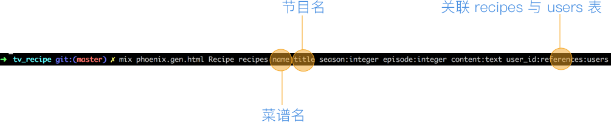

# 生成菜谱样板文件

前面的章节里，我们完成了后端系统最重要的部分：用户。接下来我们要进入菜谱模块的开发。

我们先来确认下，菜谱有哪些属性需要保存：

属性名|类型|备注|是否必填
---|---|---|---
name|string|菜谱名|必填
title|string|节目名|必填
season|integer|第几季|必填
episode|integer|第几集|必填
content|text|内容|必填
user_id|integer|关联用户的 id|必填

这里我们可以直接使用 `mix phoenix.gen.html` 命令来生成菜谱相关的所有文件：

```bash
$ mix phoenix.gen.html Recipe recipes name title season:integer episode:integer content:text user_id:references:users
* creating web/controllers/recipe_controller.ex
* creating web/templates/recipe/edit.html.eex
* creating web/templates/recipe/form.html.eex
* creating web/templates/recipe/index.html.eex
* creating web/templates/recipe/new.html.eex
* creating web/templates/recipe/show.html.eex
* creating web/views/recipe_view.ex
* creating test/controllers/recipe_controller_test.exs
* creating web/models/recipe.ex
* creating test/models/recipe_test.exs
* creating priv/repo/migrations/20170206013306_create_recipe.exs

Add the resource to your browser scope in web/router.ex:

    resources "/recipes", RecipeController

Remember to update your repository by running migrations:

    $ mix ecto.migrate
```


我们先按照提示把 `resources "/recipes", RecipeController` 加入 `web/router.ex` 文件中：

```elixir
diff --git a/web/router.ex b/web/router.ex
index e0811dc..a6d7cd5 100644
--- a/web/router.ex
+++ b/web/router.ex
@@ -20,6 +20,7 @@ defmodule TvRecipe.Router do
     get "/", PageController, :index
     resources "/users", UserController, except: [:index, :delete]
     resources "/sessions", SessionController, only: [:new, :create, :delete]
+    resources "/recipes", RecipeController
   end
```

但请不要着急执行 `mix ecto.migrate`，我们有几个需要调整的地方：

1. 新建的 `priv/repo/migrations/20170206013306_create_recipe.exs` 文件中，有如下一句代码：

    ```elixir
    add :user_id, references(:users, on_delete: :nothing)
    ```
    `on_delete` 决定 `recipe` 关联的 `user` 被删时，我们要如何处置 `recipe`。`:nothing` 表示不动 `recipe`，`:delete_all` 表示悉数删除，这里我们使用 `:delete_all`。
2. 新建的 `web/models/recipe.ex` 文件中，有一句代码：

    ```elixir
    belongs_to :user, TvRecipe.User
    ```
    因为 `Recipe` 与 `User` 的关系是双向的，所以我们需要在 `user.ex` 文件中增加一句：
    
    ```elixir
    has_many :recipes, TvRecipe.Recipe
    ```
现在，我们可以执行 `mix ecto.migrate` 了：

```bash
$ mix ecto.migrate

12:45:54.141 [info]  == Running TvRecipe.Repo.Migrations.CreateRecipe.change/0 forward

12:45:54.141 [info]  create table recipes

12:45:54.146 [info]  create index recipes_user_id_index

12:45:54.149 [info]  == Migrated in 0.0s
```
我们运行下测试看看：

```bash
$ mix test
mix test
Compiling 24 files (.ex)
Generated tv_recipe app
...............................................

Finished in 0.5 seconds
47 tests, 0 failures
```
新生成的测试目前悉数通过。

