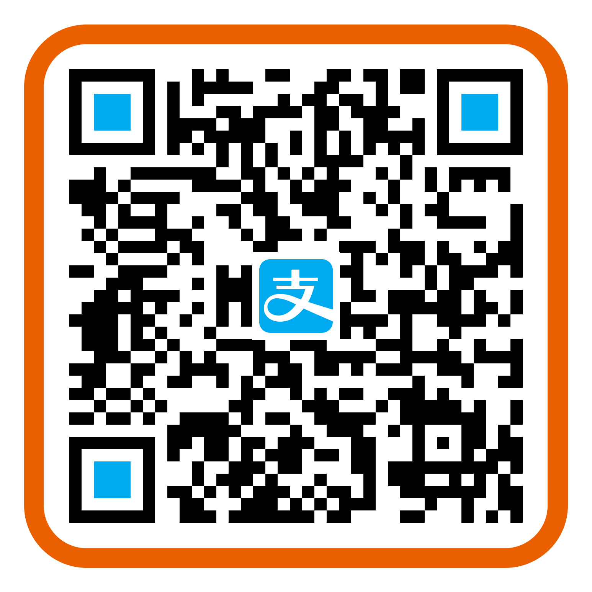

# Phoenix Framework 中文入门教程

前端开发一直都是我的主业。是的，我是在暗示你：**Phoenix Framework 非常容易上手**。不过也因为我一直在从事前端开发，后端的一些概念我可能理解得不够到位，如有错误，欢迎指正。

## 目录

0. [准备工作](00-prepare.md)
1. [创建项目](01-create-project.md)
2. [Phoenix 初体验](02-explore-phoenix.md)

## 捐款

如果教程对你有很大帮助，并且你对不介意捐款的话，欢迎扫描下方的支付宝二维码：

## License & Copyright

&copy; 2017 陈三

 本作品采用<a rel="license" href="http://creativecommons.org/licenses/by-nd/4.0/">知识共享署名-禁止演绎 4.0 国际许可协议</a>进行许可。